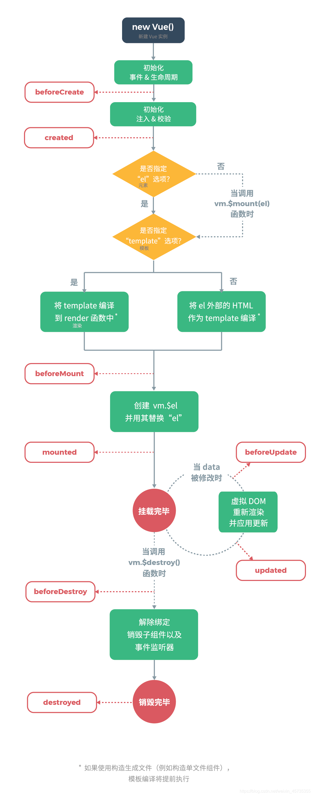
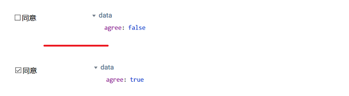

# Vue

https://blog.csdn.net/weixin_45735355/article/details/118931768

## 基本语法

### 钩子函数



> DOM 渲染在 哪个周期中就已经完成?

DOM 渲染在 mounted 中就已经完成了。

> 简单描述每个周期具体适合哪些场景?

beforecreate : 可以在此阶段加loading事件，在加载实例时触发；

created : 初始化完成时的事件写在这里，如在这结束loading事件，异步请求也适宜在这里调用；

mounted : 挂载元素，获取到DOM节点；

updated : 如果对数据统一处理，在这里写上相应函数；

beforeDestroy : 可以做一个确认停止事件的确认框；

nextTick : 更新数据后立即操作dom；

### 插值

语法：`{{ 变量名/对象.属性名 }}`

### 显示数据（v-text、v-html）

 `v-text` 和 `v-html` 专门用来展示数据, 其作用和插值表达式类似。`v-text` 和 `v-html` 可以避免插值闪烁问题.

 当网速比较慢时, 使用 `{{}}` 来展示数据, 有可能会产生插值闪烁问题。

> 插值闪烁: 在数据未加载完成时，页面会显示出原始的 `{{}}`, 过一会才会展示正常数据

``` html
<span v-text="msg"></span> <!-- 相当于<span>{{msg}}</span> -->
<span v-html="msg"></span> <!-- 相当于<span>{{msg}}</span> -->
```

**区别**：

``` html
v-text:把数据当做纯文本显示
v-html:遇到html标签，会正常解析
```

### 数据双向绑定（v-model）

vue 的双向绑定可以实现：数据变化时，页面自动刷新；页面变化时，数据也自动变化

* 文本框/单选按钮/textarea, 绑定的数据是字符串类型

* 单个复选框, 绑定的是boolean类型

``` html
<div id="app">
    <input type="checkbox" v-model="agree">同意<br>
</div>
<script type="text/javascript">
    var app = new Vue({
        el:"#app",
        data:{
            agree:true
        }
    });
</script>
```



* 多个复选框, 绑定的是数组

* select单选对应字符串，多选对应也是数组

### 事件处理（v-on）

 `v-on`：给页面元素绑定事件

**语法**：

``` html
<button v-on:事件名="函数名/vue表达式">点我</button>
<button @事件名="函数名/vue表达式">点我</button>
```

> vue 支持 html 中所有已知事件，如 @click、@submit 等, 只不过事件的名字不带on

**事件修饰符**：

事件修饰符主要对事件的发生范围进行限定。

``` 
.stop ：阻止事件冒泡, 也就是当前元素发生事件,但当前元素的父元素不发生该事件
.prevent ：阻止默认事件发生
.capture ：使用事件捕获模式, 主动获取子元素发生事件, 把获取到的事件当自己的事件执行
.self ：只有元素自身触发事件才执行。（冒泡或捕获的都不执行）
.once ：只执行一次
```

### 遍历循环（v-for）

#### 遍历数组

**语法**：

```html
v-for="item in items"
v-for="(item,index) in items"
```

* items：要迭代的数组
* item：存储数组元素的变量名
* index：迭代到的当前元素索引，从0开始。

#### 遍历对象

**语法**：

``` 
v-for="value in object"
v-for="(value,key) in object"
v-for="(value,key,index) in object"
```

* value，对象的值
* key， 对象的键
* index, 索引，从0开始

#### :key

 :key 一般配合 v-for 一起使用. 用来在特定情况下, 保证被遍历的数组中的元素的顺序.

``` html
<div id="app">
    <button @click="add">添加</button>
    <ul>
        <!-- 添加:key即可. 注意,key中的值必须是唯一且不会改变的值-->
        <li v-for="name in list" :key="name">
            <input type="checkbox"> {{name}}
        </li>
    </ul>
</div>
<script>
    var app = new Vue({
        el: '#app',
        data: {
            list: ["孙悟空", "猪八戒", "沙和尚"]
        },
        methods: {
            add() {
                //注意这里是unshift,向数组的头部添加一个元素
                this.list.unshift("唐僧");
            }
        }
    });
</script>
```

### 判断语法（v-if 和 v-show）

``` 
v-if: 条件不满足时, 元素不会存在.
v-show: 条件不满足时, 元素不会显示(但仍然存在).
```

### 显示数据（v-bind）

 v-bind 主要用于动态设置标签的属性值

**语法**：

``` html
<标签名 v-bind:标签属性名="vue实例中的数据属性名"/>
<标签名 :标签属性名="vue实例中的数据属性名"/>
```

## 其他语法

### 计算属性

计算属性就是一个提前定义好的方法, 该方法可以看作是一个特殊的值, 可以在插值表达式中使用.

**语法**：

``` javascript
 var app = new Vue({
     el:"#app",
     //计算属性必须放在Vue的computed中
     computed:{
         //定义计算属性
         属性名(){
             return "返回值";
         }
     }
});
```

**例子**：

``` vue
<div id="app">
    <h1>{{birth}}</h1>
    <h1 v-text="birth"></h1>
    <h1 v-html="birth"></h1>
</div>
<script type="text/javascript">
    var app = new Vue({
        el:"#app",
        computed:{
            //定义一个birth方法,该方法就是一个计算属性,可以在插值表达式中使用
            birth(){
                let date = new Date();
                let year = date.getFullYear();
                let month = date.getMonth()+1;
                let day = date.getDay();
                return year + "-" + month + "-" + day;
            }
        }
    });
</script>
```

### watch 监控

 watch可以监听简单属性值及其对象中属性值的变化.

 **语法**：

``` javascript
var app = new Vue({
    el:"#app",
    data:{
        message:"白大锅",
        person:{"name":"heima", "age":13}
    },
    //watch监听
    watch:{
        //监听message属性值,newValue代表新值,oldValue代表旧值
        message(newValue, oldValue){
        	console.log("新值：" + newValue + "；旧值：" + oldValue);
        },
        //监控person对象的值,对象的监控只能获取新值
        person: {
            //开启深度监控；监控对象中的属性值变化
            deep: true,
            //获取到对象的最新属性数据(obj代表新对象)
            handler(obj){
                console.log("name = " + obj.name + "; age=" + obj.age);
            }
        }
    }
});
```

## 组件

``` vue
<div id="app">
    <!--使用组件,如果组件名称中有大写字母,如"myList",则这里需要书写<my-list>-->
    <counter></counter>
    <counter></counter>
</div>
<script type="text/javascript">
    //定义组件
    const counterTemp = {
        //定义组件的模版
        template:`<button @click='num++'>你点击了{{num}}次</button>`,
        //定义组件中使用到的数据属性
        data(){
           return {
              num:0
           }
        } 
    };    

    //全局注册组件：在所有的vue实例中都可以使用组件
    //参数1：组件名称，参数2：具体的组件
    //Vue.component("counter", counterTemp);
    
    var app = new Vue({
        el:"#app",
        //局部注册组件: 只能在当前Vue实例中使用
        components:{
            //组件名称:具体组件
            counter: counterTemp
        }
    });
</script>
```

### 父子组件通信

* **父组件向子组件通信**（即父组件向子组件传递数据）：`props`

``` vue
<div id="app">
     <!-- 把父组件中的count传递给子组件的number属性,把父arr传递给子ids,把父p传递给子person -->
    <aaa :number="count" :ids="arr" :person="p"></aaa>
</div>

<script>
    var aaa = {
        //定义组件的模版
        template: `<h2>{{num}}---{{number}}--{{ids}}--{{person}}</h2>`,
        //定义组件中使用到的数据属性
        data() {
            return {
                num: 0
            }
        },
        //给组件添加属性
        props: {
            //普通属性number
            number: "",
            //数组属性ids
            ids: [],
            //对象属性person
            person: {}
        }
    };

    //注册:全局注册
    Vue.component("aaa", aaa);

    var app = new Vue({
        el: "#app",
        data: {
            count: 5,
            arr: [1, 2, 3],
            p: {username: "zhangsan", age: 23}
        }
    });
</script>
```

* **子组件向父组件通信**：

> 子组件无法直接给父组件传递数据. 也无法操作父组件中的数据.
>
> 所以, 所谓的子组件向父组件通讯, 其实就是想办法让子组件调用父组件的方法. 进而响应到父组件中的数据.

```vue
<div id="app">
    <!-- 把父组件的add方法,绑定给子组件的aaa属性,绑定方法使用@属性名="方法名" -->
    <!-- 把父组件的rem方法,绑定给子组件的bbb属性,绑定方法使用@属性名="方法名 -->
    <counter @aaa="add" @bbb="rem"></counter>
</div>

<script>
    //定义一个组件(模版)
    let counter = {
        template: `
             <div>
                   <input type="button" @click="fun1" value="+"/>
                   <input type="button" @click="fun2" value="-"/>
            </div>
                `,
        props:{
            //定义aaa属性,用来绑定父组件的方法,当然,该定义也可以省略
            aaa:function(){},
            //定义bbb属性,用来绑定父组件的方法,当然,该定义也可以省略
            bbb:function(){},
        },       
        methods:{
            fun1(){
                //找到aaa属性所绑定的那个方法,执行那个方法
                return this.$emit("aaa");
            },
            fun2(){
                //找到bbb属性所绑定的那个方法,执行那个方法
                return this.$emit("bbb");
            }
        }
    }

    var app = new Vue({
        el: '#app',
        data: {
            app_num: 0
        },
        components: {
            counter
        },
        methods:{
            add(){
                this.app_num++;
            },
            rem(){
                this.app_num--;
            }
        }
    });
</script>
```

## axios 异步请求

* **常见的方法**：
  * `axios(config)`
  * `axios.get(url, [config])`
  * `axios.post(url, [data])`

* **发送数据config常用参数：**

```json
{
    url: '请求的服务器',
	method: '请求方式', // 默认是 get
    // GET请求参数
    params: {
    	参数名: 参数值
    },
	// POST请求参数, 如果使用axios.post,则参数在url之后直接书写,不需要该位置传递参数
    data: {
    	参数名: 参数值
    },
	// 响应数据格式,默认json
	responseType: 'json'
}
```

* GET

``` javascript
axios.get("请求路径",{
    //get请求参数
    params: {
        name:"zhangsan",
        age:23
    },
    //响应数据格式为"json"
    responseType: 'json'
}).then(res => {
    //打印响应数据
    console.log(res);
    //把响应数据赋值给Vue中的user属性
    app.user = res.data;
}).catch(err => {
    //打印响应数据(错误信息)
    console.log(err);
});
```

* POST

``` javascript
axios.post("请求路径",{
        name:"zhangsan",
        age:23
}).then(res => {
    console.log(res);
    app.user = res.data;
}).catch(err => {
    console.log(err);
});
```

